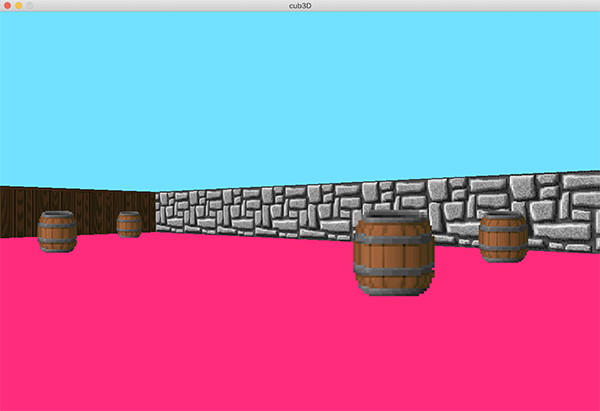

# 42_cub3D


The cub3D is a project belonging to the 42 programming campus and the whole network.

This project is inspired by the game Wolfenstein of the 90s, which was the first FPS in history. The purpose of this challenge is to develop a program that simulates the operation of this famous video game.

The main objective is to control the ray casting technique and apply it to the program



To run the program, first make a git clone of the repository:

```bash
https://github.com/Bortize/42_cub3d.git
```
<br>

Then, in the main branch, run
```bash
make re
```
<br>

Finally, to open the sale and move on to the game, run:
```bash
./cub3D maps/map.cub
```
<br>

To access the commenting code, you must switch to the documentary branch with the following command
 ```bash
 git checkout documentary
 ```

 Download the Linenote vscode extension, and enjoy walking through the code, along with its explanation.


